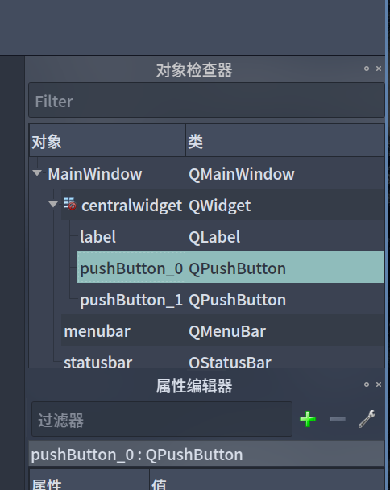

### PushButton的用法

PushButton 是 QT 的一个按钮控件，可以被触发  
### 添加
在 QT Designer 中左侧的窗口部件盒中找到 PushButton 然后可以拖到窗口上。  
在右侧对象检查器中可以修改对象名，例如我们将一个 PushButton 命名为 `pushButton_0`  
对象名很重要，我们设计部件的事件都是依靠对象名进行定位  


然后我们可以在属性编辑器中对这个按钮的外观进行自定义  

### python代码

#### 1.添加事件
一个点击事件:  
```python
self.ui.pushButton_0.clicked.connect(self.clickButton_0)
```
在我们的 `mainwindow` 这个类的 `__init__` 方法中添加这行代码  
`self.ui`对应着载入的`main.ui`文件  
而`pushButton_0`是我们刚才定义的按钮对象名  
clicked 是当按下并释放后执行的信号  
然后我们用 `connect` 传参  
之后的`self.clickButton_0`是我们之后要定义的一个方法，这里可以先行放空  
#### 事件方法
我们在`mainwindow`类添加一个方法：
```python
def clickButton_0(self):   ##定义第一个按钮功能
    print("点击第一个按钮")
```
这个实际就是一个函数，在面向对象里面叫做方法。方法内的代码就是我们要运行的内容  
例如本文是在触发`clicked`信号后打印"点击第一个按钮"       
