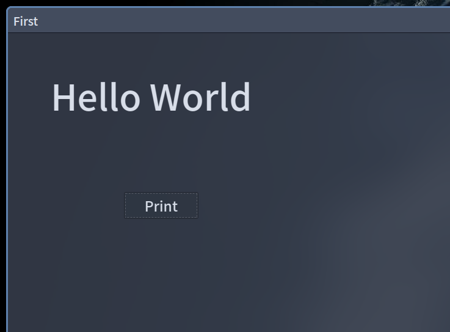

### Hello World

第一个 pyqt 文件！  
效果:  


主要是用到 QLable 和 QPushButton  
都在 QtDesigner 可以找到  
我们在 QtDesigner 进行窗口设计完成后保存成 `.ui`文件。  
然后就可以在 python 中调用  
下面是一个例子：  
### 开始
我们目录下有:`main.ui`和`main.py`  
在`main.py`调用 ui 文件(不喜欢转成 py 因为那样挺乱的)

调用必须库
``` python
import sys
from PyQt5.QtWidgets import QApplication, QMainWindow
from PyQt5 import uic
```

导入`main.ui`，QT主体  
这是一个 `mainwindow`类  
我们把`main.ui`载入在`self.ui`  
然后用`show()`函数运行显示
> `super().__init__()`我暂时还不知道有什么作用

``` python
class mainwindow(QMainWindow):
    def __init__(self):
        super().__init__()
        self.ui=uic.loadUi("main.ui")
        self.ui.show()
```

程序末尾加一个判断语句  
```python
if __name__=="__main__":
    app=QApplication(sys.argv)
    window=mainwindow()
    sys.exit(app.exec_())
```

那么，在有了上述代码后，我们设计的`main.ui`就可以运行在 pyqt 上了  
这时候的程序只能显示，还干不了什么  
